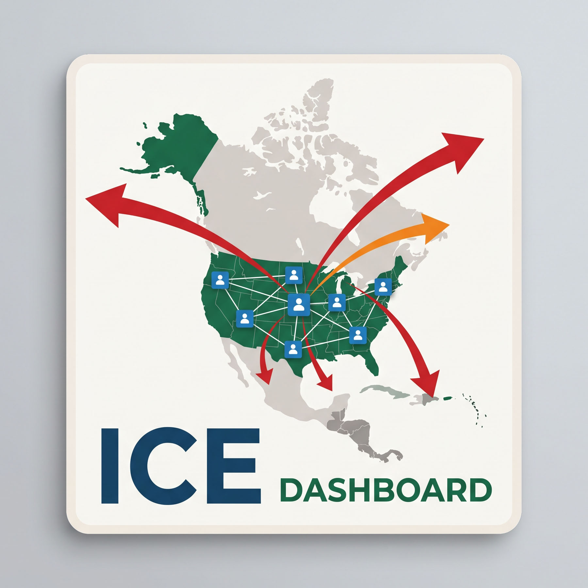

{fig-alt="ICE Dashboard logo" width="200"}

Public data and analysis on U.S. Immigration and Customs Enforcement (ICE)
detention facilities and arrests, drawn from ICE's published detention
statistics, FOIA-released data archived by the Deportation Data Project, and
prior research by the Vera Institute of Justice and The Marshall Project.

## Sections

**National detention mapping** — Comparisons of ICE's published annual
detention statistics against FOIA-released daily population data (FY25 and
FY26), facility tables and profiles, and an interactive map of detention
facilities.

**Arrest tracking** — ICE arrest data at the nationwide, state, and Minnesota
levels.

**Output to Wikipedia** — Tools for generating Wikipedia infoboxes and list
tables documenting ICE detention facilities.
